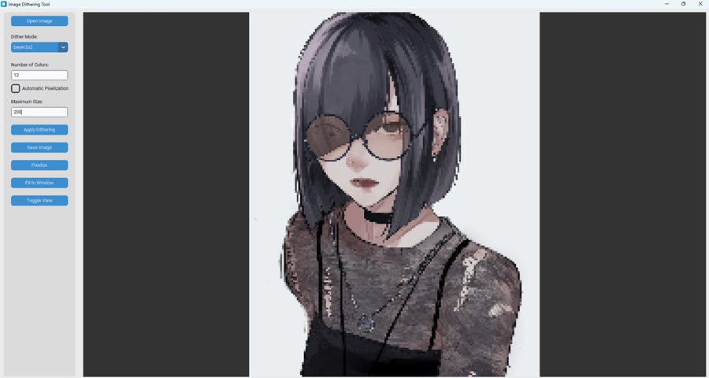
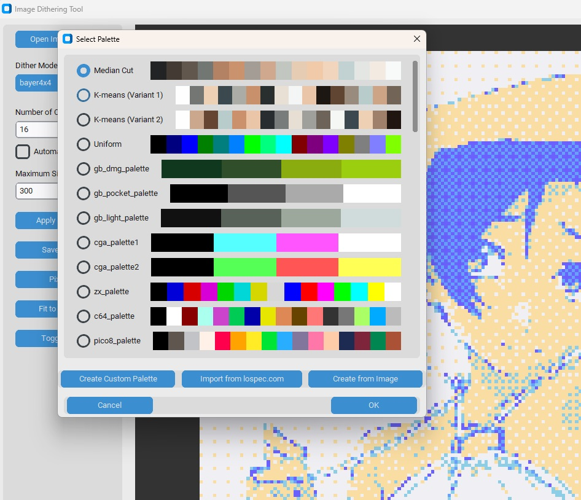
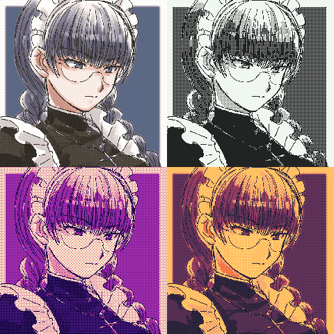
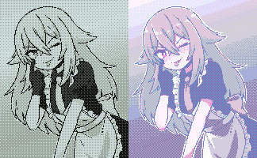
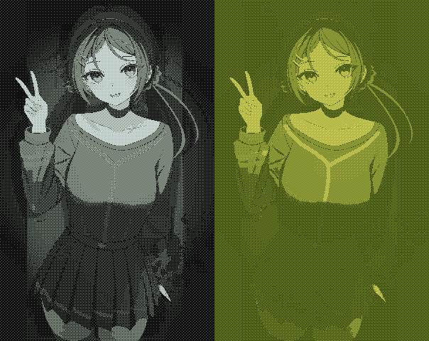

# Image Dithering Tool

This repository provides a Python-based tool for applying different forms of **dithering** to images (and videos), either through a **Graphical User Interface (GUI)** or via a **Command-Line Interface (CLI)**. The tool also supports **pixelization** (reducing image size with nearest-neighbor interpolation) and allows the creation and management of **custom palettes**. It now includes **video previews** demonstrating results on short clips.

---

## Quick Start (GUI)

1. **Install Dependencies**  
   - Ensure you have Python 3.7+ installed, and install these packages:
     - Pillow
     - numpy
     - scikit-learn
     - customtkinter
     - tkinter (often included by default with Python on many systems)
2. **Run the GUI**  
   - `python dither_pie.py`
   This launches the main application window. From there, you can open an image or video, choose dithering/pixelization options, work with palettes, and preview results interactively.  
   - **Gamma Correction** is optional. To enable it, check the "Use Gamma Correction" box in the sidebar.

---

## GUI Screenshots

Below are a few example screenshots illustrating the interface:

[](## "Screenshot of the main window")  
[](## "Screenshot of the palette dialog")

---

## Using the CLI

To use the command-line interface, run:

`python dither_pie.py [command] [options]`

You can automate operations like pixelization, dithering, palette creation, etc. The main commands are:

1. **pixelize**  
   - Usage example:  
     `python dither_pie.py pixelize input_image output_image --max-size 640`
   - Resizes the image or video with nearest-neighbor interpolation to produce a pixelized (low-res) effect.

2. **dither**  
   - Usage example:  
     `python dither_pie.py dither input_image output_image --mode bayer4x4 --colors 16`
   - Applies dithering to the input image or video. Optional parameters let you:
     - Pick a dithering matrix (`bayer2x2`, `bayer4x4`, `bayer8x8`, `bayer16x16`, or `none`).
     - Choose the number of colors (`--colors 16`).
     - Provide an algorithmic palette (e.g., `--algo-palette kmeans_variant1` or `--algo-palette median_cut`).
     - Use a custom palette from `palette.json` via `--palette <palette_name>`.
     - **Enable gamma correction** with `--gamma-correction` (converts sRGB ↔ linear).

3. **dither-pixelize**  
   - Usage example:  
     `python dither_pie.py dither-pixelize input_image output_image --mode bayer4x4 --colors 16 --max-size 320`
   - Pixelizes and dithers the input in one go (especially convenient for videos).  
   - Also accepts `--gamma-correction`.

4. **import-lospal**  
   - Usage example:  
     `python dither_pie.py import-lospal https://lospec.com/palette-list/my-cool-palette`
   - Downloads a palette definition from lospec.com and adds it to `palette.json`.

5. **create-pal-from-image**  
   - Usage example:  
     `python dither_pie.py create-pal-from-image my_image.jpg --colors 16 --name MyPalette`
   - Generates a new palette (via K-means) from any given image, storing it in `palette.json` for reuse.

---

## Example Dithered Images

Below are examples of still images processed with various dithering modes and palettes:

[](## "7cats / Roberta")  
[](## "ink / inksgirls")  
[](## "asagi ryo sample")  
[](## "kenomotsu yukuwa / MiSide")

---

## Video Previews

Now, the `misc` folder includes short video demos illustrating the results of dithering/pixelization on sample clips. You can watch them below:

<video src="https://github.com/user-attachments/assets/51eeacd6-c3bb-4e4e-9249-bcc954649c68"></video>
<video src="https://github.com/user-attachments/assets/f81f9e8a-4cb4-4acf-8619-96709243e227"></video>
<video src="https://github.com/user-attachments/assets/8ba5a42c-407b-48f5-95ea-6cf6d941b219"></video>

These clips demonstrate how pixelization and different dithering modes combine to produce retro or stylized results.

---

## Custom Palettes

A `palette.json` file stores user-defined palettes. Each entry has a `name` and a list of `colors` (hex codes). For example:

```json
{
  "name": "gb_dmg_palette",
  "colors": [
    "#0f381f",
    "#304e2a",
    "#8bac0f",
    "#9bce0f"
  ]
}
```

You can create, import, or edit palettes via:

- **GUI**: Click "Apply Dithering" -> "Select Palette" -> "Create Custom Palette" or "Import from lospec.com."
- **CLI**: Use `import-lospal` or `create-pal-from-image`, or manually edit `palette.json`.
