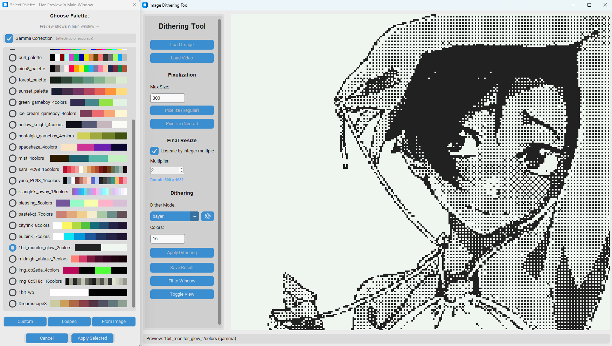
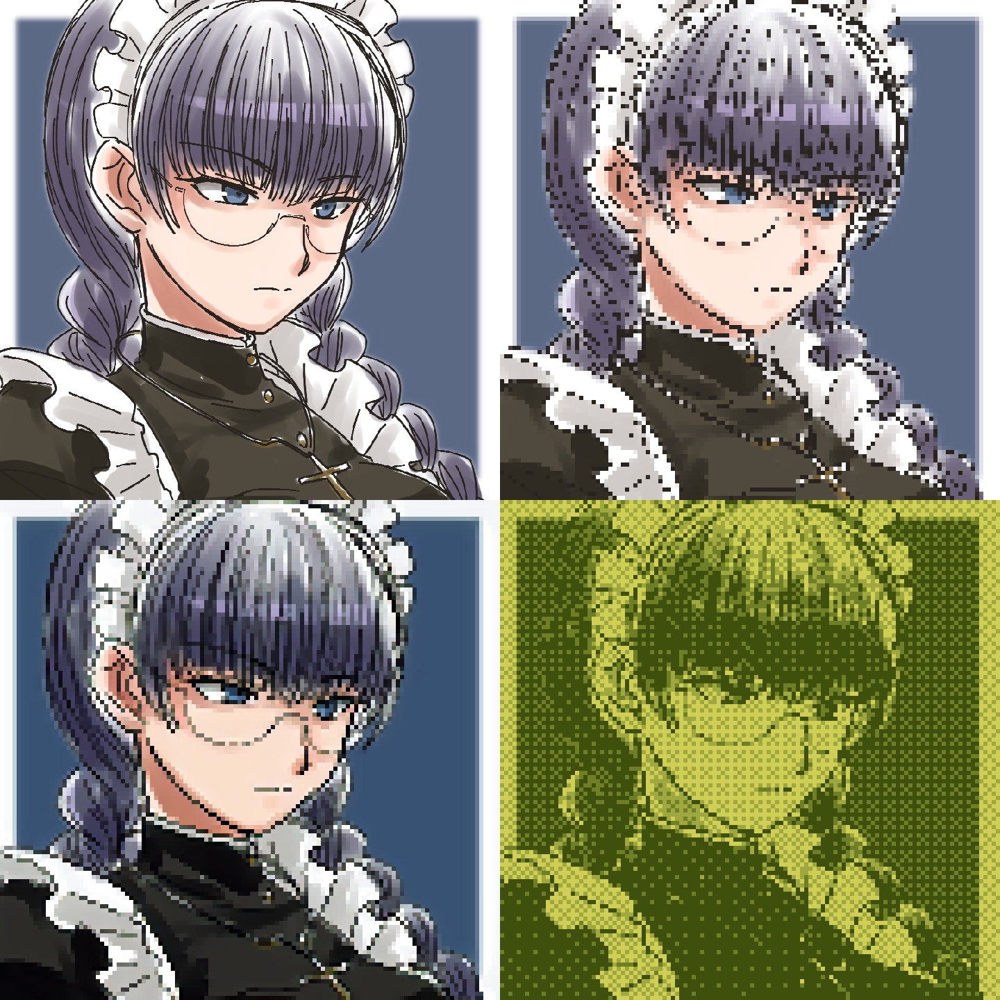
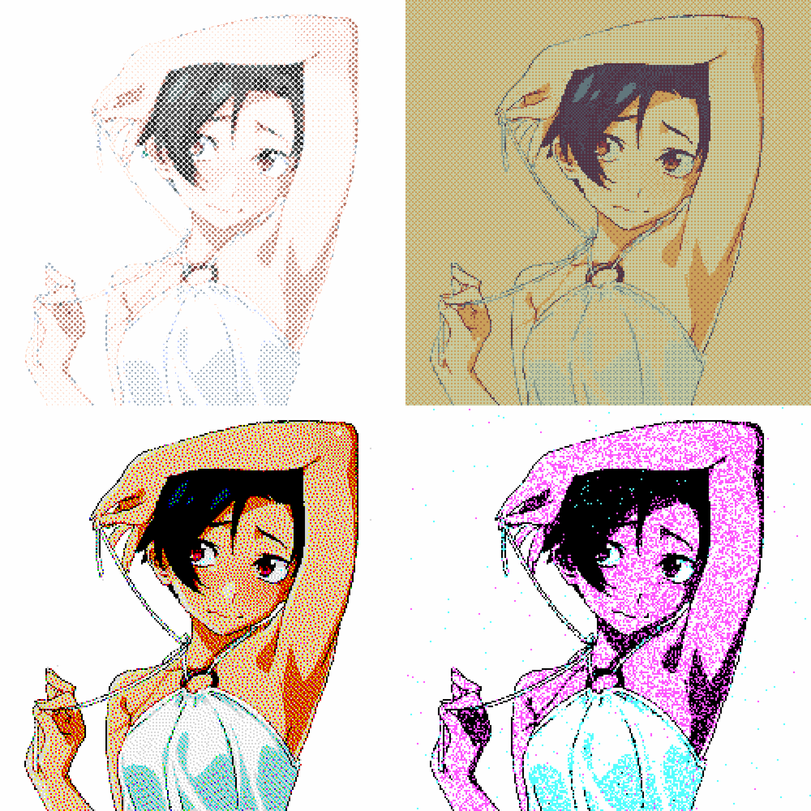
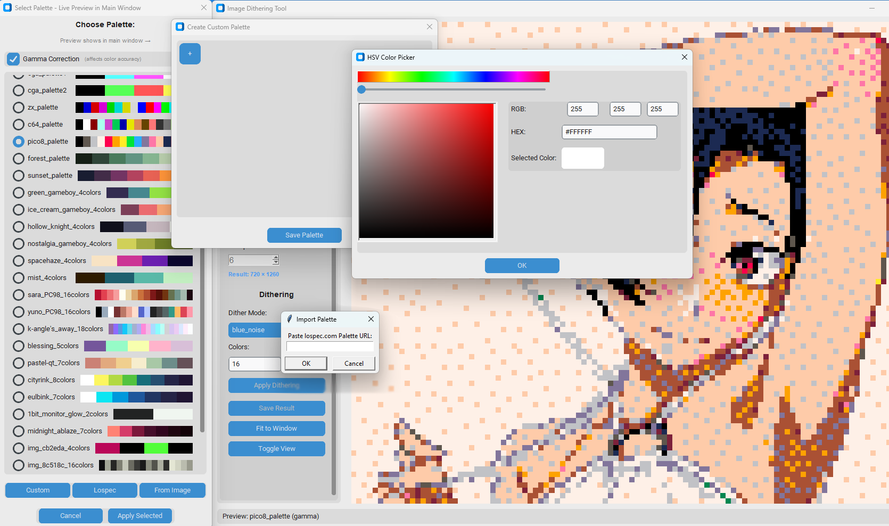

# Dither Pie - Advanced Image & Video Dithering Tool

A powerful Python-based application for applying artistic dithering and pixelization effects to images and videos. Features both intuitive GUI and powerful CLI modes with intelligent caching, live previews, and professional-quality retro visual effects.

---

## 🎯 Key Features

### Dual Interface Modes
- 🖥️ **GUI Mode**: Interactive interface with live preview and visual palette selection
- 💻 **CLI Mode**: Batch processing with JSON configs, progress bars, and automation support

### Image & Video Processing
- ✅ **Images**
- ✅ **Videos**
- ✅ **Batch Processing**: Process entire folders with progress tracking
- ✅ **Random Frame Preview**: Test settings on any video frame (GUI)
- ✅ **Multi-core Processing**: Fast video rendering with multiprocessing

### Pixelization Methods
- **Regular**: Fast nearest-neighbor downsampling for classic pixel art
- **Neural**: AI-powered artistic pixelization using PyTorch models

### 12 Dithering Algorithms
- **Bayer** - Ordered dithering with configurable matrix size (2x2, 4x4, 8x8, 16x16)
- **Error Diffusion** - 8 classic algorithms in one: Floyd-Steinberg, JJN, Stucki, Burkes, Atkinson, Sierra (3 variants)
- **Ostromoukhov** - Adaptive error diffusion with variable coefficients
- **Riemersma** - Hilbert curve-based space-filling error diffusion
- **Blue Noise** - High-quality spatial distribution with configurable seed
- **Polka Dot** - Retro circular threshold patterns
- **Halftone** - Newspaper-style printing simulation with rotating screens
- **Wavelet** - Multi-scale frequency decomposition dithering
- **Adaptive Variance** - Context-aware dithering based on local variance
- **Perceptual** - Luminance-preserving error diffusion
- **Hybrid** - Separates luminance/color channels for detail preservation

### Advanced Features
- 🚀 **Smart Caching**: Re-dither without re-pixelizing, blue noise matrices cached in memory
- 👁️ **Live Palette Preview**: See results in main window before applying (GUI)
- 🔄 **Toggle View During Preview**: Compare original with preview while selecting palette (GUI)
- ⚙️ **Configurable Algorithms**: Fine-tune parameters for 10+ dithering modes via settings dialog
- 🌀 **Animated Status Bar**: Visual feedback with customizable spinner animations
- 💾 **Persistent Settings**: Window position, defaults, and paths remembered
- 🎨 **Custom Palettes**: Create, import from lospec.com, or extract from images

---

## 📸 Screenshots

### Main Interface

[](## "Screenshot of the main window")  


### Live Palette Preview

<video src="https://github.com/user-attachments/assets/9e1bd1a9-f81e-43a7-9194-3f3f029deb61"></video>  


### Before/After Comparison Grid

[](## "Before/After Comparison Grid")  


### Dithering Modes and Palettes Showcase

[](## "Dithering and Palettes Showcase")  


### Custom Palette Dialog
[](## "Dithering and Palettes Showcase")  


### Video Processing Preview

<video src="https://github.com/user-attachments/assets/fa8d2a63-8821-4859-96f5-7cb6e32af45d"></video>  
<video src="https://github.com/user-attachments/assets/b83c9bc7-1f2e-4d47-862d-5a9e9aa5f928"></video>  
<video src="https://github.com/user-attachments/assets/0557a0a1-9d8f-44cf-821c-738b1224cc36"></video>  

---

## 🚀 Installation

### Prerequisites
- Python 3.7 or higher
- FFmpeg (in system PATH for video processing)

### Required Packages
```bash
pip install pillow numpy scikit-learn customtkinter opencv-python pywavelets torch torchvision scipy rich
```

### Neural Models (Optional)
Download model files for neural pixelization from:
[Neural Models - MEGA](https://mega.nz/folder/mdtnQT4K#ZkoSrVAIubonAzZuJ9QUlA)

Place in project root:
- `160_net_G_A.pth`
- `alias_net.pth`
- `pixelart_vgg19.pth`

---

## 📖 Quick Start Guide

### Launching the Application

**GUI Mode (no arguments):**
```bash
python dither_pie.py
```

**CLI Mode (with config file):**
```bash
python dither_pie.py config.json
```

**CLI Mode (with input override):**
```bash
python dither_pie.py config.json input_image.png
```

### GUI Basic Workflow
1. **Load Image/Video** → Click "Load Image" or "Load Video"
2. **Pixelize** (optional) → Choose Regular or Neural, set max size
3. **Apply Dithering** → Select palette and see live preview
4. **Save Result** → Export as PNG or process full video

### CLI Basic Workflow
1. **Create config** → Generate example: `python dither_pie.py --example-config`
2. **Edit settings** → Modify JSON with your parameters
3. **Process** → Run: `python dither_pie.py your_config.json`
4. **Batch process** → Point input to folder for batch processing

### Example Workflows

#### Classic Pixel Art Effect (GUI)
```
1. Load Image
2. Pixelize (Regular) - Max Size: 64
3. Apply Dithering - Select Bayer mode, 16 colors
4. Choose palette in dialog (live preview in main window)
5. Enable "Upscale by integer multiple" (2x-4x)
6. Apply Selected → Save Result
```

#### High-Quality Retro Effect (GUI)
```
1. Load Image
2. Pixelize (Neural) - Max Size: 128
3. Apply Dithering - Select Blue Noise mode, 32 colors
4. In palette dialog: Enable Gamma Correction
5. Try different palettes (preview updates instantly)
6. Compare with Toggle View button
7. Apply Selected → Save
```

#### Dithering Only (No Pixelization) (GUI)
```
1. Load Image
2. Skip pixelization step
3. Apply Dithering - Select Hybrid mode
4. Choose "From Image" to extract palette from reference
5. Save Result (preserves full resolution)
```

#### Batch Processing (CLI)
```bash
# Create config
python dither_pie.py --example-config > my_settings.json

# Edit settings in my_settings.json
# Set desired dithering mode, colors, etc.

# Process folder
python dither_pie.py my_settings.json my_photos/
# Creates my_photos_processed/ with all results
```

---

## 🎨 Palette Management

### Built-in Palette Generation
- **Median Cut**: Classic color quantization algorithm
- **K-means**: Machine learning-based clustering
- **Uniform**: Evenly distributed color space

### Custom Palettes
1. **Manual Creation**: HSV color picker with RGB/HEX input
2. **Import from Lospec.com**: Paste URL, instant import
3. **Extract from Image**: K-means clustering on reference image

### Palette File
Palettes stored in `palette.json`:
```json
{
  "name": "gameboy_dmg",
  "colors": ["#0f381f", "#304e2a", "#8bac0f", "#9bce0f"]
}
```

### Live Preview Workflow
During palette selection, you can:
- **View Live Previews**: Each palette generates a preview shown in the main window
- **Toggle View**: Click "Toggle View" button to compare original image with current preview
- **Adjust Settings**: Change dither mode or parameters (⚙️) while previewing
- **Zoom & Pan**: Examine details - zoom/pan state preserved between palette switches
- **Toggle Gamma**: See instant difference with/without gamma correction

This allows you to:
1. Select a palette → Preview appears
2. Toggle to original → Compare side-by-side mentally
3. Try another palette → Toggle back to see new preview
4. Adjust parameters → Preview updates automatically
5. Apply when satisfied

---

## 💻 CLI Mode - Command Line Interface

Dither Pie includes a powerful CLI for automation, batch processing, and scripting workflows.

### CLI Features
- 📁 **Batch Processing**: Process entire folders automatically
- 📊 **Progress Tracking**: Rich progress bars and status updates
- 🔧 **JSON Configuration**: Reusable config files for consistent results
- 🎨 **Full Feature Access**: All GUI features available via CLI
- 📝 **Verbose Logging**: Optional detailed output and log files
- ⚡ **Smart Filename Generation**: Auto-generates descriptive output names
- 🔄 **Input Override**: Apply same settings to different files easily

### Basic Usage

```bash
# Show help and available options
python dither_pie.py --help

# Generate example configuration file
python dither_pie.py --example-config > my_config.json

# Process with config file
python dither_pie.py my_config.json

# Process specific file with config settings (auto-generates output name)
python dither_pie.py config.json input_image.png

# Process entire folder (creates processed folder)
python dither_pie.py config.json input_folder/

# Verbose output with log file
python dither_pie.py -v --log-file processing.log config.json
```

### Example Configuration

```json
{
    "input": "path/to/input.png",
    "output": "path/to/output.png",
    "pixelization": {
        "enabled": true,
        "method": "regular",
        "max_size": 128
    },
    "dithering": {
        "enabled": true,
        "mode": "bayer",
        "parameters": {}
    },
    "palette": {
        "source": "median_cut",
        "num_colors": 16,
        "use_gamma": false
    },
    "final_resize": {
        "enabled": false,
        "multiplier": 2
    }
}
```

### Palette Sources

- `"median_cut"` - Classic color quantization
- `"kmeans"` - ML-based clustering
- `"uniform"` - Evenly distributed color space
- `"file:path.png"` - Extract from another image
- `"gameboy_dmg"` - Palette name from `palette.json`
- Any custom palette name saved in GUI

### Command Line Options

| Option | Description |
|--------|-------------|
| `--help`, `-h` | Show help message |
| `--example-config` | Generate example configuration |
| `--verbose`, `-v` | Enable verbose (DEBUG) logging |
| `--quiet`, `-q` | Quiet mode (errors only) |
| `--log-file FILE` | Write log to file |

### Batch Processing Example

```bash
# 1. Create a config for your desired settings
python dither_pie.py --example-config > batch_settings.json

# 2. Edit batch_settings.json with your preferred dithering settings

# 3. Process entire folder
python dither_pie.py batch_settings.json my_images/
# Output: my_images_processed/ folder created with all processed files

# 4. Review results with summary statistics
```

**For detailed CLI documentation, see `CLI_USAGE.md`**

### Example Configuration Files

The `examples/` folder contains ready-to-use configuration files:

- `image_basic.json` - Basic image dithering (median cut palette)
- `image_pixelized.json` - Regular pixelization + dithering
- `image_neural.json` - Neural pixelization + dithering
- `image_custom_palette.json` - Using custom palettes from palette.json
- `video_basic.json` - Video processing example
- `batch_folder.json` - Batch folder processing setup
- `settings_override.json` - Example of settings override pattern

Copy and modify these for your needs!

---

## 🎛️ Configuration System (GUI)

User preferences automatically saved to `config.json` when using GUI mode:

```json
{
  "window": {
    "width": 1400,
    "height": 900,
    "x": 100,
    "y": 50,
    "maximized": false
  },
  "defaults": {
    "max_size": 640,
    "num_colors": 16,
    "dither_mode": "bayer",
    "use_gamma": false
  },
  "ui": {
    "spinner_name": "dots"
  },
  "paths": {
    "last_image_dir": "C:/Users/...",
    "last_video_dir": "C:/Videos/..."
  },
  "recent_files": [...]
}
```


---

## 🎥 Video Processing Details

### Features
- Frame-by-frame processing with dithering
- Audio stream preserved
- Subtitle track support
- H.264 encoding with yuv420p
- Even dimension enforcement (codec compatibility)


### Video Workflow
1. Load video → Shows first frame
2. Test on random frames
3. Configure settings with live preview
4. "Apply to Video" → Choose output path
5. Multi-core processing with progress bar

---

## ⚙️ Configurable Dithering Parameters

Many dithering modes include adjustable parameters accessible via the **⚙️ settings button** next to the dithering mode dropdown.

### Algorithms with Settings

| Algorithm | Configurable Parameters | Description |
|-----------|------------------------|-------------|
| **Bayer** | Matrix Size | Choose 2x2, 4x4, 8x8, or 16x16 (default: 4x4) |
| **Error Diffusion** | Variant, Serpentine Scan | 8 algorithms: Floyd-Steinberg, JJN, Stucki, Burkes, Atkinson, Sierra (3 variants). Toggle serpentine scanning for artifact reduction. |
| **Ostromoukhov** | Serpentine Scan | Adaptive error diffusion with optional serpentine scanning |
| **Blue Noise** | Matrix Size, Random Seed | Size (64-512), seed for reproducible patterns |
| **Polka Dot** | Tile Size, Gamma | Dot pattern size and gamma adjustment |
| **Halftone** | Cell Size, Screen Angle, Dot Gain, Dot Size Range, Shape, Sharpness | Full control over newspaper-style halftone printing |
| **Wavelet** | Wavelet Type, Subband Quantization | Choose wavelet family (haar, db1-10) and quantization strength |
| **Adaptive Variance** | Variance Threshold, Window Radius | Context-awareness sensitivity and local analysis window |
| **Hybrid** | Luminance Factor, Color Factor | Balance between luminance and color channel processing |

### How to Use Settings
1. Select a dithering mode from dropdown
2. Click **⚙️** button (enabled for modes with parameters)
3. Adjust parameters in dialog
4. Click **Apply** to update preview instantly
5. Changes are cached with each palette for easy comparison

**Note:** Settings button is disabled for modes without configurable parameters (None, Riemersma, Perceptual).

---

## 💡 Tips & Best Practices

### For Best Quality
- ✅ Use **Neural pixelization** for organic subjects (faces, nature)
- ✅ Use **Regular pixelization** for geometric/UI elements
- ✅ Enable **Gamma correction** for accurate color perception
- ✅ Try **Blue Noise**, **Error Diffusion (Atkinson)**, or **Hybrid** for smooth gradients
- ✅ Use **Halftone** for authentic newspaper/magazine printing effects
- ✅ Use **Riemersma** or **Error Diffusion (Floyd-Steinberg)** for detailed line art
- ✅ Adjust algorithm parameters via ⚙️ settings button for fine control (GUI) or JSON config (CLI)

### Performance Tips
- ✅ Test on random frames before processing full video (GUI)
- ✅ Test on single file before batch processing (CLI)
- ✅ Use lower max_size for faster neural processing
- ✅ Regular pixelization is 50-100x faster than neural
- ✅ Preview different palettes without re-pixelizing (uses cache in GUI)
- ✅ Use CLI batch mode for processing large folders (pre-loads neural models once)

### Workflow Tips
- ✅ **GUI for experimentation**: Live preview helps find perfect settings
- ✅ **CLI for production**: Use settings from GUI experiments in JSON configs
- ✅ **Batch processing**: Test settings on one file, then apply to folder via CLI
- ✅ **Save configurations**: Create reusable JSON configs for different styles

### Common Use Cases
- **Print/Halftone Effects**: Halftone mode (no pixelization), adjust screen angle and dot size
- **8-bit Game Art**: Regular + Bayer (4x4), 4-16 colors, custom palette
- **Retro Mac Look**: Error Diffusion (Atkinson variant), serpentine off
- **Artistic Effects**: Neural + Blue Noise or Error Diffusion (JJN), 32-64 colors, gamma on
- **Newspaper Style**: Halftone mode with 6-8 colors, angle 45°, gamma on
- **Web Optimization**: Dither + resize for smaller file sizes with preserved detail
- **Batch Photo Processing**: Use CLI with JSON config for consistent results across many files

---

## 🔧 Technical Details

### Architecture
```
dither_pie.py          → Entry point (routes to GUI or CLI based on arguments)
dither_pie_gui.py      → Main GUI (customtkinter) with live preview system
dither_cli.py          → CLI interface with Rich terminal output
dithering_lib.py       → 12 dithering algorithms with configurable parameters
video_processor.py     → Multi-core video processing with FFmpeg
config_manager.py      → Persistent configuration with JSON storage
gui_components.py      → Reusable UI widgets (settings dialog, animated status bar, zoomable image)
utils.py               → Palette management (generation, import, extraction)
models/                → Neural pixelization models (PyTorch)
spinners.json          → Animated spinner definitions for status bar
examples/              → Example configuration files for CLI
```

### Dependencies
- **GUI**: customtkinter, tkinter
- **CLI**: rich (terminal output, progress bars, logging)
- **Image**: Pillow, numpy
- **ML**: PyTorch, scikit-learn
- **Video**: FFmpeg (subprocess), opencv-python
- **Math**: scipy, pywavelets

### Technical Highlights
- **Dual Interface Architecture**: Single entry point routes to GUI or CLI based on arguments
- **Strategy Pattern**: Each dithering algorithm is a separate strategy class
- **Metadata-Driven UI**: Parameter dialogs generated from algorithm metadata (`get_parameter_info()`)
- **Separation of Concerns**: GUI, CLI, and core algorithms are fully decoupled
- **Smart Caching**: Multi-level caching (pixelization, preview, blue noise matrices)
- **Live Preview System**: Non-blocking preview generation with threading (GUI)
- **Rich Terminal Output**: Beautiful CLI with progress bars, spinners, and colored logging
- **Config Validation**: Comprehensive JSON schema validation with helpful error messages
- **Animated Feedback**: Status bar with configurable spinner animations from `spinners.json`
- **State Management**: Palette dialog state tracking for toggle view functionality

### Key Design Decisions
- **Single Entry Point**: `dither_pie.py` routes to GUI (no args) or CLI (with args)
- **Shared Core Library**: Both GUI and CLI use identical dithering algorithms
- **No Parameter Persistence Across Modes**: Each algorithm starts with defaults when selected
- **Preview Cache by Settings**: Cache key includes palette, gamma, dither mode, and all parameters
- **In-Memory Blue Noise**: Generated matrices cached during session, not persisted
- **Serpentine Off by Default**: Cleaner look for most use cases, easily toggled in settings
- **Path Resolution**: CLI config paths resolved relative to config file location

### Credits
Neural pixelization models from:
- [arenasys/pixelization_inference](https://github.com/arenasys/pixelization_inference)
- [WuZongWei6/Pixelization](https://github.com/WuZongWei6/Pixelization)


